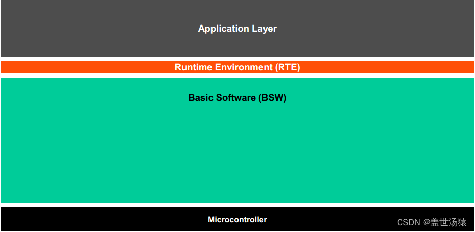
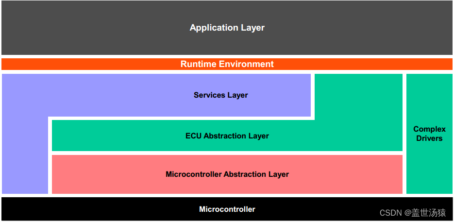
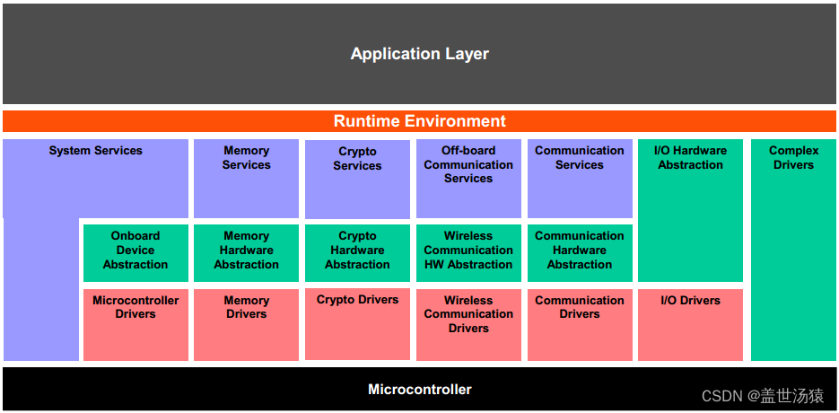

# AUTOSAR

## 1. 引言

**1 为何需要AUTOSAR(Automotive Open System Architecture)?**

1. 汽车电子硬件系统多样，ECU软件开发受硬件系统的制约，当更新硬件是，会导致ECU软件重新编写或大规模修改、测试，造成了高昂的研发费用和漫长的研发周期。
2. 汽车电子网络向多总线混合网络互联方向发张，其软件架构也正向模块化、平台化、标准化方向发展，随着汽车电子电气系统的复杂性增加，开发周期和成本在上升，整车企业为降低控制软件开发风险，亟需提高软件复用度的方法。

**2 目标和愿景：**

> **该架构旨在改善汽车电子系统软件的更新与交换，同时更方便有效地管理日趋复杂的汽车电子软件系统。通过建立面向汽车工业的通用嵌入式系统架构，实现接口的标准化并提升复杂系统开发的质量与效率。**

**3 优势**

1. 有利于提高软件跨平台的复用度。

2. 便于软件的交换和更新。
3. 软件功能可以先期在架构级别定义和验证，从而减少开发错误，提高软件开发质量。

## 2. AUTOSAR的软件分层架构

在最高抽象级别下分为三层：

- 应用程序
- 运行时环境
- 基础软件

### 1. 基础软件BSW

进一步分为以下几层：

- 服务层

  - 是BSW的最高层，为应用层、RTE和基础软模块提供基础服务（系统、存储、通信服务）。

  - 实现：主要独立于$\mu$C和硬件。

    > μC/OS是一款嵌入式系统。

- ECU抽象层

  - 使更高的软件层独立于ECU硬件布局
  - ECU抽象层与微控制器抽象层的驱动程序接口。

- 微控制器抽象层

  - 是基础软件的最低软件层
  - 包含内部驱动程序，可直接访问$\mu$C和内部为外围设备的软件模块。
  - 使更高的软件层独立于$\mu$C.

- 复杂驱动程序

  - 范围从硬件到RTE。
  - 用于迁移，使得软件组件能够在不同的系统或设备中重用。

基础软件层进一步划分为功能组。服务的例子有**系统、内存和通信服务**。

### 2. RTE

 RTE是向应用软件（AUTOSAR软件组件和/或AUTOSAR传感器/执行器组件）提供通信服务的层。

上层接口：完全独立于ECU

